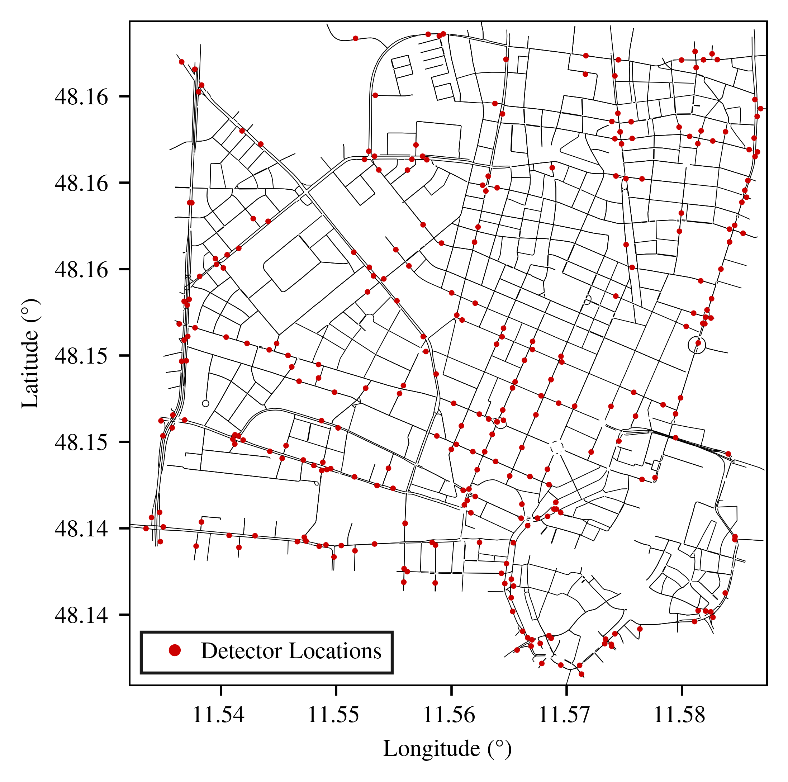

# SUMO Benchmark Scenario: Munich City Center

This repository contains a calibrated microscopic traffic simulation scenario for the Munich city center, implemented in Eclipse SUMO. 

The demand scenario represents a typical weekday morning peak (06:00-12:00). It was synthesized using a data-driven framework that fuses sparse Inductive Loop Detector (ILD) counts with Floating Car Data (FCD) via Gradient Boosting to constrain the optimization-based route sampling process.

## Network and Calibration Performance
The simulated road network covers an area of 11.5 km². It includes 309 km of roads and 164 signalized intersections. 

The final microscopic simulation achieves high fidelity with empirical ground-truth measurements, demonstrating an $R^2$ of 0.986. This metric is based on the ground truth inductive loop detector measurements at 293 edges with detector coverage, as seen on the map below.



## Repository Structure

* `demand/`
    * `sampled_routes.rou.xml`: The generated microscopic trip set.
    * `vehicle_types.add.xml`: Definition of vehicle parameters.
* `gui/`
    * `munich_scenario.view.xml`: Viewport configurations for the SUMO-GUI.
* `network/`
    * `munich_scenario.net.xml`: The calibrated SUMO road network.
    * `munich_scenario.poly.xml`: Polygon data for visualization (e.g., buildings, water).
* `munich_scenario.sumocfg`: The main SUMO configuration file.
* `study_area_detector_locations.png`: Map of the network and inductive loop detector coverage.

## Usage
The scenario was tested using Eclipse SUMO version 1.26.0.

To run the simulation with the graphical user interface, execute the following command in the root directory:

```bash
sumo-gui -c munich_scenario.sumocfg